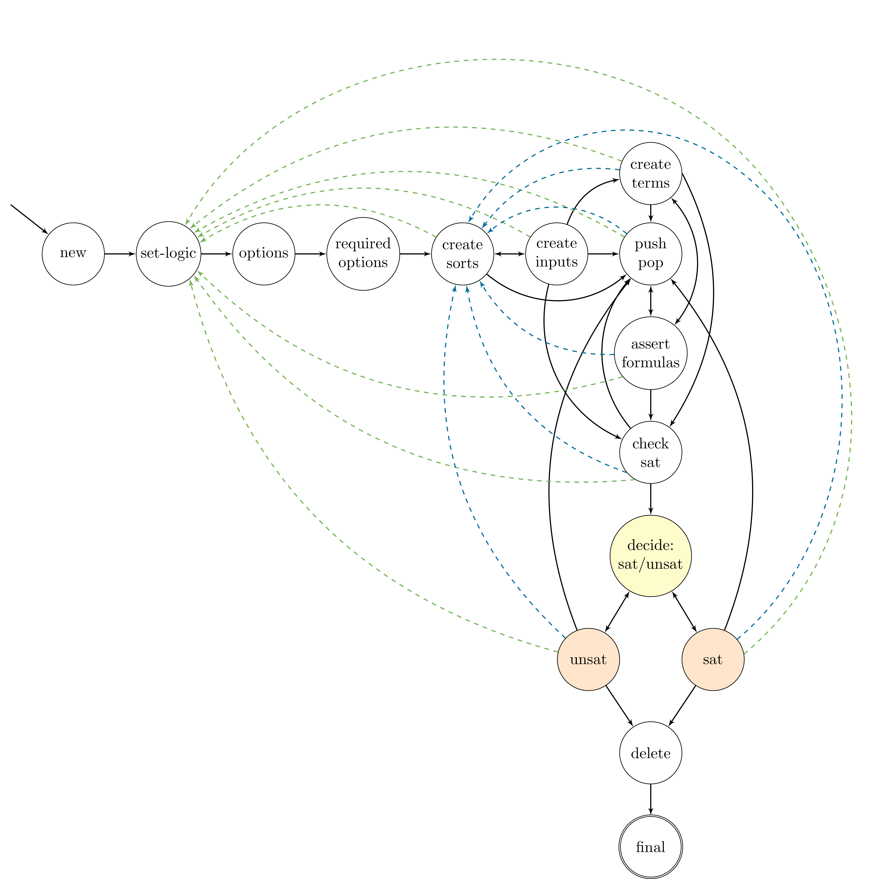

FSM
===

Murxla defines a generic API model based on
`SMT-LIB <http://smt-lib.org>`_ semantics, implemented as a weighted
finite state machine (:cpp:class:`murxla::FSM`).
:doc:`States <state>` of the FSM correspond to the current state of
the solver, and transitions have a weight, a pre-condition, and an associated
:doc:`action <action>`.

   The API model of Murxla, implemented as a finite state machine.

   Arrows indicate transitions, actions associated to transitions are omitted.
   Green transitions are associated with action :cpp:class:`murxla::ActionReset`
   (SMT-LIB: ``reset``) and blue transitions with action
   :cpp:class:`murxla::ActionResetAssertions` (SMT-LIB: ``reset-assertions``).

.. doxygenclass:: murxla::FSM
    :members:
    :undoc-members:
