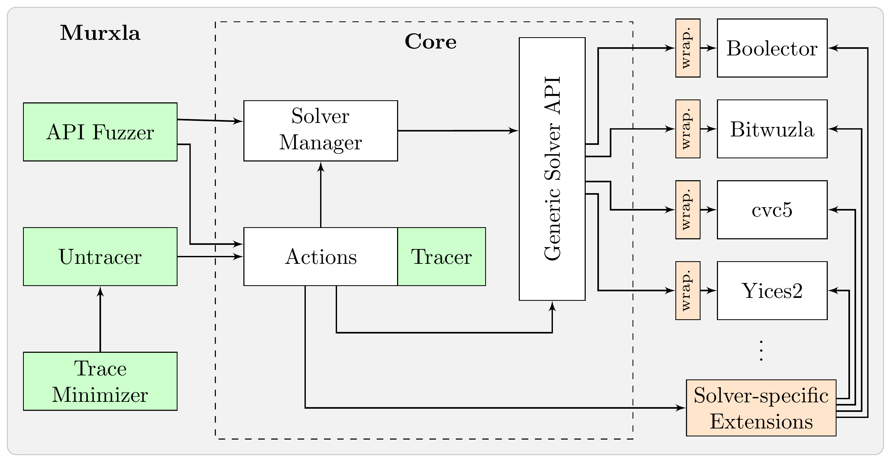

Murxla Documentation
====================

**Murxla** is a modular and highly-extensible model-based API fuzzer for
Satisfiability Modulo Theories (SMT) solvers.

Its name is derived from the German (rather informal) word *Murks*, which can
be translated as "screw-up". Murxla is a tool to find *Murkses* (bugs) in SMT
solvers via API fuzzing.

Murxla is written in C++ and aims at being a comprehensive fuzzing tool that

- generates **valid sequences** of solver API calls
- **records** these sequences in a simple text-based trace format
  (see :ref:`tracing`)
- provides support for **minimizing** and **replaying** these traces while
  preserving the original behavior of the solver (delta-debugging)

   The architecture of Murxla.

Murxla builds on top of a generic solver interface (see :ref:`solver-wrappers`)
and provides full `SMT-LIB <http://smt-lib.org>`_ support in terms of
semantics, features, standard theories. It further provides experimental
support for some non-standard theories (sequences, sets, bags).

Murxla is fully compatible with and configurable for **solver-specific**
features, extensions, and restrictions. It provides support for

- **option fuzzing** (randomly configuring solver options based on the options
  model of the solver)
- **cross-checking mode**, where the answers of two different solvers are
  compared with each other
- **correctness checks** for retrieved model values, unsat assumptions, and
  unsat cores
- translating generated API traces to **SMT-LIBv2** (if they don't use solver-specific extensions)
- SMT-LIBv2 **input fuzzing**

Table of Contents
^^^^^^^^^^^^^^^^^
.. toctree::
  :maxdepth: 1

  install
  usage
  solver_integration/solver_integration
  advanced/advanced

